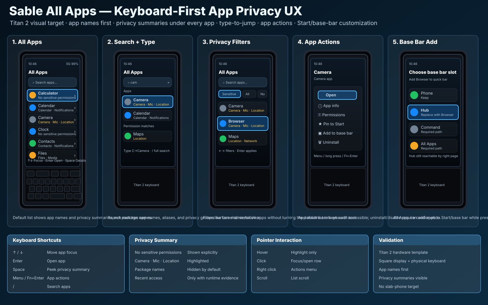

# All Apps visual confirmation

Status: **source-controlled visual target — keyboard-first All Apps**

This document binds the All Apps / App Privacy Summary UX contract to a durable
Titan 2 visual artifact for future UI/build validation.



## Scope

The artifact covers the Titan 2 square All Apps target and the common
keyboard-first app discovery model that should also inform Titan 2 Elite and Q27.

```text
ALL_APPS_VISUAL_ARTIFACT_SOURCE_CONTROLLED=YES
CHAT_ONLY_IMAGE=NO
TITAN2_ALL_APPS_VISUAL_TARGET=YES
TITAN2_HARDWARE_TEMPLATE=YES
SQUARE_DISPLAY_PLUS_PHYSICAL_KEYBOARD=YES
NO_SLAB_PHONE_VISUAL_TARGET=YES
NO_STRETCHED_SCREEN_TARGET=YES
BUILD_CODE_CHANGED=NO
DEVICE_CODE_CHANGED=NO
FLASH_ENABLEMENT=NO
```

## Required visual elements

Implementation should preserve the following user-visible structure unless a
later reviewed visual replaces it:

```text
All Apps home
  title: All Apps
  visible search field near top
  app names as primary text
  privacy/security summary under each app
  sensitive access highlighted without alarmist language
  no package names by default
  visible focus ring

Search state
  app search field
  app-name matches
  privacy/permission group matches
  type-to-jump behavior

Filter state
  All
  Sensitive access
  No sensitive permissions
  Recently used
  Pinned to Start
  Base bar candidates

App actions state
  Open
  App info
  Permissions
  Pin to Start
  Add to base bar
  Uninstall when allowed and confirmed

Base bar add state
  choose or replace quick-bar slot
  preserve required fallback paths
  Hub may be replaced as a base slot because Hub remains reachable by right page
```

## App privacy summary target

```text
APP_NAMES_PRIMARY=YES
PACKAGE_NAMES_DEFAULT_VISIBLE=NO
PRIVACY_SUMMARY_UNDER_APP=YES
SHOW_NO_SENSITIVE_PERMISSIONS=YES
SHOW_SENSITIVE_BADGES=YES
RAW_PERMISSION_NAMES_DEFAULT_VISIBLE=NO
```

Examples:

```text
Calculator
  No sensitive permissions

Calendar
  Calendar · Notifications

Camera
  Camera · Microphone · Location

Contacts
  Contacts · Notifications
```

## Keyboard target

```text
Up / Down
  move app row focus

Enter
  open selected app

Space
  expand / peek privacy summary where available

Menu / Fn+Enter / long press
  open app actions

/ or Search key
  focus app search

Printable letters
  type-to-jump when search is not focused
  edit search when search is focused

Back
  return to Start or previous surface
```

## Pointer target

```text
Hover
  visual hover only; do not steal keyboard focus

Click row
  focus and open row

Right click / long press
  app actions menu

Scroll wheel
  scroll list
```

## Build/UI validation checklist

Future implementation or visual review should produce evidence for:

```text
ALL_APPS_VISUAL_ARTIFACT_PRESENT=PASS
ALL_APPS_TITAN2_VISUAL_TARGET=PASS
TITAN2_HARDWARE_TEMPLATE=PASS
SQUARE_DISPLAY_PLUS_PHYSICAL_KEYBOARD=PASS
APP_NAMES_PRIMARY=PASS
PACKAGE_NAMES_HIDDEN_BY_DEFAULT=PASS
PRIVACY_SUMMARY_UNDER_APP=PASS
SENSITIVE_PERMISSION_BADGES=PASS
NO_SENSITIVE_PERMISSIONS_SUMMARY=PASS
TYPE_TO_JUMP=PASS
FULL_APP_SEARCH=PASS
PRIVACY_FILTERS=PASS
APP_ACTIONS_KEYBOARD_ACCESSIBLE=PASS
PIN_TO_START=PASS
ADD_TO_BASE_BAR=PASS
MOUSE_POINTER_INTERACTION=PASS
VISIBLE_FOCUS=PASS
NO_FOCUS_TRAPS=PASS
NO_SLAB_PHONE_VISUAL_TARGET=PASS
NO_STRETCHED_SCREEN_TARGET=PASS
```

## Non-goals

```text
NO_MAC_DESIGN_BUILD_REQUIRED
NO_DEVICE_BUILD_REQUIRED_FOR_THIS_ARTIFACT
NO_FLASH_ENABLEMENT
NO_PACKAGE_NAME_AS_PRIMARY_LABEL
NO_RAW_PERMISSION_NAME_SPAM_IN_DEFAULT_LIST
NO_TOUCH_ONLY_APP_ACTIONS
```
