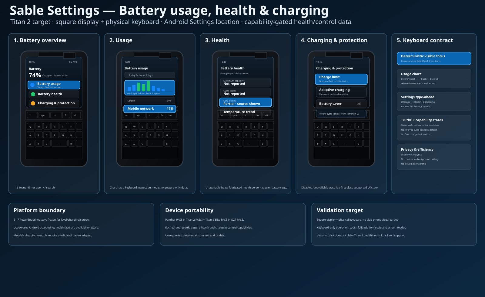

# Battery usage and health visual confirmation

Status: **source-controlled visual target — keyboard-first Settings**  
Date: **2026-10-04**

This document binds the Battery usage/health design contract to a durable Titan 2
square-display visual artifact.



## Scope

The artifact covers:

```text
Settings -> Battery overview
Battery usage
Battery health
Charging & protection
keyboard chart inspection / capability-gated unavailable states
```

The artifact is a design target, not evidence that a particular Titan 2 battery
health or charging-control backend already exists.

```text
BATTERY_VISUAL_ARTIFACT_SOURCE_CONTROLLED=YES
TITAN2_HARDWARE_TEMPLATE=YES
SQUARE_DISPLAY_PLUS_PHYSICAL_KEYBOARD=YES
SLAB_PHONE_VISUAL_TARGET=NO
KEYBOARD_PRIMARY_INPUT=YES
TOUCH_SECONDARY_INPUT=YES
RUNTIME_DATA_CLAIM=NO
CHARGING_BACKEND_QUALIFIED_BY_ARTIFACT=NO
```

## Visual posture

Battery remains inside the familiar Android Settings hierarchy. The design does
not use a launcher base bar or introduce a separate Battery app.

The square-display posture is intentionally list-first:

- compact status summary;
- one dominant focus target;
- short, scannable metric rows;
- bounded chart height;
- strong focus ring;
- shortcut hint footer only where useful.

## Screen 1 — Battery overview

Required structure:

```text
Battery
  current percentage and charging state
  Battery usage
  Battery health
  Charging & protection
  Battery saver
```

The first focused row should be obvious without relying only on color.

## Screen 2 — Battery usage

Required structure:

```text
time range
bounded chart
top system/app consumers
detail rows
```

Charts support keyboard inspection. The selected bucket exposes a text value.

## Screen 3 — Battery health

The approved artifact deliberately demonstrates an **unavailable/partial data**
state. This is important: the design must look complete even when a vendor does
not expose cycle count or maximum capacity.

Required states include:

```text
value available
value estimated with confidence/source
value unavailable
```

No placeholder percentage may be mistaken for measured health.

## Screen 4 — Charging & protection

Mutable controls are capability-gated. On an unqualified profile, the visual
target shows a disabled/unavailable row rather than a fake working toggle.

```text
CHARGE_LIMIT_UNQUALIFIED_STATE=VISIBLE_AND_HONEST
ADAPTIVE_CHARGING_UNQUALIFIED_STATE=VISIBLE_AND_HONEST
BATTERY_SAVER_ANDROID_CONTROL=AVAILABLE_WHERE_PLATFORM_SUPPORTS
```

## Keyboard behavior represented by the artifact

```text
Up/Down    move focus
Enter      open/confirm
Space      toggle supported focused switch
Left/Right change range or inspect chart bucket
/          Settings search
Back/Esc   return / leave inspection mode
```

Type-ahead remains the common Settings contract:

```text
U -> Battery usage
H -> Battery health
C -> Charging & protection
```

## Data disclaimer

Numbers and labels inside the SVG are illustrative UX examples only.

They do not assert:

- Titan 2 maximum capacity support;
- Titan 2 cycle-count support;
- Titan 2 charge-limit support;
- Titan 2 adaptive-charging support;
- any runtime battery-health measurement.

Actual implementation must consume profile/runtime evidence.

## Build/UI validation checklist

```text
BATTERY_VISUAL_ARTIFACT_PRESENT=PASS
BATTERY_TITAN2_TEMPLATE=PASS
BATTERY_SLAB_PHONE_TARGET=PASS_ABSENT
BATTERY_ANDROID_SETTINGS_LOCATION=PASS
BATTERY_VISIBLE_FOCUS=PASS
BATTERY_LIST_FIRST_SQUARE_LAYOUT=PASS
BATTERY_USAGE_CHART_BOUNDED=PASS
BATTERY_CHART_KEYBOARD_INSPECTION=PASS
BATTERY_HEALTH_UNAVAILABLE_STATE=PASS
BATTERY_CHARGING_UNQUALIFIED_STATE=PASS
BATTERY_TOUCH_FALLBACK=PASS
BATTERY_NO_LAUNCHER_BASE_BAR=PASS
```

## Non-goals

```text
NO_DEVICE_BUILD_REQUIRED_FOR_DESIGN_ARTIFACT
NO_FLASH_ENABLEMENT
NO_BATTERY_BACKEND_CLAIM
NO_RAW_SYSFS_CONTROL
NO_SEPARATE_BATTERY_LAUNCHER_APP
```
