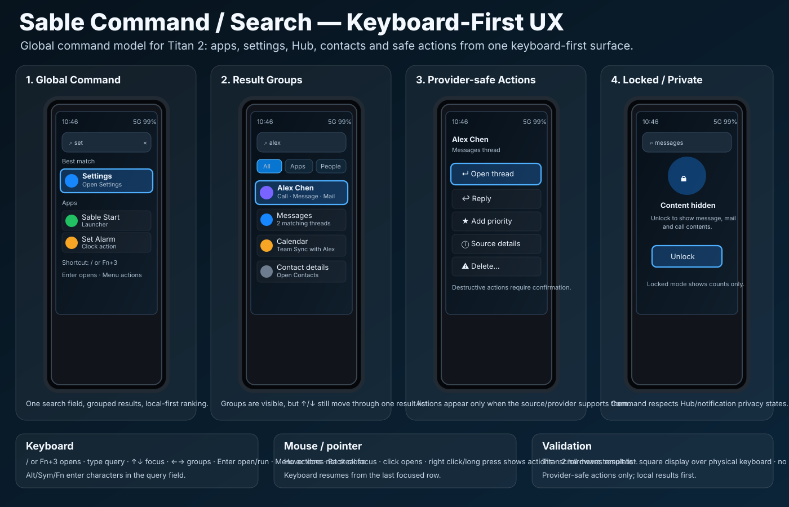

# Sable Command / Search visual confirmation

Status: **source-controlled visual target — keyboard-first Command/Search**

This document binds the Sable Command / Search UX contract to a durable visual
artifact for Titan 2 square-profile validation.



## Scope

The artifact covers the Titan 2 square profile and the common keyboard-first
Command/Search model used by Sable Start, Settings, All Apps and Hub.

```text
COMMAND_VISUAL_ARTIFACT_SOURCE_CONTROLLED=YES
CHAT_ONLY_IMAGE=NO
TITAN2_COMMAND_VISUAL_TARGET=YES
TITAN2_HARDWARE_TEMPLATE=YES
SQUARE_DISPLAY_PLUS_PHYSICAL_KEYBOARD=YES
NO_SLAB_PHONE_VISUAL_TARGET=YES
NO_STRETCHED_SCREEN_TARGET=YES
BUILD_CODE_CHANGED=NO
DEVICE_CODE_CHANGED=NO
FLASH_ENABLEMENT=NO
```

## Required visual elements

Implementation should preserve the following user-visible structure unless a
later reviewed visual replaces it:

```text
Command overlay
  title/search field near top
  current query text
  grouped local results
  app/settings/contact/Hub/action examples
  visible focus on selected result
  row source labels
  safe row actions

Actions menu
  provider-safe actions only
  disabled/hidden unsupported provider actions
  confirm destructive actions

Privacy state
  locked/private mode with redacted content
  counts-only communication results
```

## Interaction target

```text
/ or Command shortcut
  open Command/Search

Type letters
  edit query

Up / Down
  move result focus

Left / Right
  change group/filter focus where active

Enter
  open focused result or run safe primary action

Space
  preview/peek if allowed

Menu / Fn+Enter
  open row actions

Alt+Enter
  open source/details when available

Back / Esc
  close and restore prior focus

Sym / Alt / Fn in search field
  enter symbols and alternate characters
```

## Build/UI validation checklist

Future implementation or visual review should produce evidence for:

```text
COMMAND_VISUAL_ARTIFACT_PRESENT=PASS
COMMAND_SEARCH_FIELD_VISIBLE=PASS
RESULT_GROUPS_VISIBLE=PASS
VISIBLE_FOCUS=PASS
APP_RESULTS_VISIBLE=PASS
SETTINGS_RESULTS_VISIBLE=PASS
HUB_RESULTS_VISIBLE=PASS
CONTACT_ACTIONS_VISIBLE=PASS
PROVIDER_SAFE_ACTIONS_VISIBLE=PASS
LOCKED_PRIVATE_MODE_VISIBLE=PASS
ALT_SYM_FN_TEXT_ENTRY=PASS
MOUSE_POINTER_INTERACTION=PASS
TITAN2_HARDWARE_TEMPLATE=PASS
NO_FOCUS_TRAPS=PASS
```

## Non-goals

```text
NO_MAC_DESIGN_BUILD_REQUIRED
NO_DEVICE_BUILD_REQUIRED_FOR_THIS_ARTIFACT
NO_FLASH_ENABLEMENT
NO_AI_REQUIRED_FOR_COMMAND
NO_PROVIDER_CREDENTIAL_OWNERSHIP
NO_UNSUPPORTED_PROVIDER_ACTIONS
```
