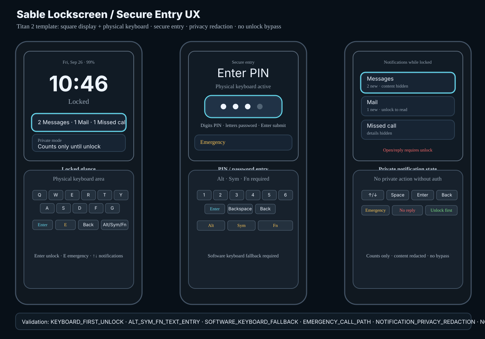

# Lockscreen visual confirmation

Status: **source-controlled visual target — Lockscreen / Secure Entry**

This document binds the lockscreen secure-entry UX contract to a durable Titan 2
visual artifact that can be reviewed before implementation and used as a target
for future UI/build validation.



## Scope

The artifact covers Titan 2 square-display lockscreen states: locked glance,
secure PIN/password entry, privacy-redacted notifications, failed unlock feedback
and emergency access.

```text
LOCKSCREEN_VISUAL_ARTIFACT_SOURCE_CONTROLLED=YES
CHAT_ONLY_IMAGE=NO
TITAN2_LOCKSCREEN_VISUAL_TARGET=YES
TITAN2_HARDWARE_TEMPLATE=YES
SQUARE_DISPLAY_PLUS_PHYSICAL_KEYBOARD=YES
NO_SLAB_PHONE_VISUAL_TARGET=YES
NO_STRETCHED_SCREEN_TARGET=YES
BUILD_CODE_CHANGED=NO
DEVICE_CODE_CHANGED=NO
FLASH_ENABLEMENT=NO
```

## Required visual elements

Implementation should preserve the following user-visible structure unless a
later reviewed visual replaces it:

```text
Locked glance
  large time/date
  lock status
  battery/network status
  redacted Hub/notification counts
  visible keyboard hints

Secure entry
  PIN/password field
  visible focus
  physical-keyboard entry affordance
  software keyboard fallback statement
  emergency action remains reachable

Notification privacy
  counts by default
  message/mail content redacted when locked/private
  private actions require unlock

Failed unlock
  clear feedback
  no password echo
  lockout/countdown when platform policy requires
```

## Interaction target

```text
Enter        show secure entry / submit active prompt
Digits       enter PIN
Letters      enter password when password mode active
Alt/Sym/Fn   enter alternate and symbol characters
Backspace    delete active field character
Back         dismiss prompt or return to locked glance
E            emergency call action from locked glance
Up/Down      notification row focus
Left/Right   action focus where actions are visible
Space        safe preview/focus only; no unlock bypass
Home         remain locked until authentication succeeds
```

## Privacy target

```text
LOCKED_NOTIFICATION_MODE=REDACTED_BY_DEFAULT
PRIVATE_MODE=COUNTS_ONLY
HUB_SUMMARY_WHILE_LOCKED=COUNTS_ONLY
INLINE_REPLY_WHILE_LOCKED=NO_BY_DEFAULT
OPEN_PRIVATE_CONTENT_REQUIRES_UNLOCK=YES
AUTH_REQUIRED_FOR_PRIVATE_ACTIONS=YES
```

## Critical text-entry target

```text
TITAN2_LOCKSCREEN_PIN_ENTRY=REQUIRED
TITAN2_LOCKSCREEN_PASSWORD_ENTRY=REQUIRED
TITAN2_LOCKSCREEN_ALT_ENTRY=REQUIRED
TITAN2_LOCKSCREEN_SYM_ENTRY=REQUIRED
TITAN2_LOCKSCREEN_FN_ENTRY=REQUIRED
TITAN2_SOFTWARE_KEYBOARD_FALLBACK=REQUIRED
```

## Build/UI validation checklist

Future implementation or visual review should produce evidence for:

```text
LOCKSCREEN_VISUAL_ARTIFACT_PRESENT=PASS
SOURCE_CONTROLLED_VISUAL_TARGET=PASS
TITAN2_HARDWARE_TEMPLATE=PASS
ANDROID_LOCKSCREEN_MENTAL_MODEL=PASS
KEYBOARD_FIRST_UNLOCK=PASS
PHYSICAL_KEYBOARD_PIN_PASSWORD_ENTRY=PASS
ALT_SYM_FN_TEXT_ENTRY=PASS
SOFTWARE_KEYBOARD_FALLBACK=PASS
NOTIFICATION_PRIVACY_REDACTION=PASS
HUB_PRIVATE_MODE_COMPATIBLE=PASS
EMERGENCY_CALL_PATH_REQUIRED=PASS
FAILED_UNLOCK_FEEDBACK=PASS
NO_FOCUS_TRAPS=PASS
NO_UNLOCK_BYPASS=PASS
```

## Non-goals

```text
NO_MAC_DESIGN_BUILD_REQUIRED
NO_DEVICE_BUILD_REQUIRED_FOR_THIS_ARTIFACT
NO_FLASH_ENABLEMENT
NO_LOCKSCREEN_BASE_QUICK_BAR
NO_UNLOCK_BYPASS
NO_SECRET_SHORTCUTS_AROUND_KEYGUARD
NO_FULL_MESSAGE_BODY_BY_DEFAULT_WHEN_LOCKED
```
