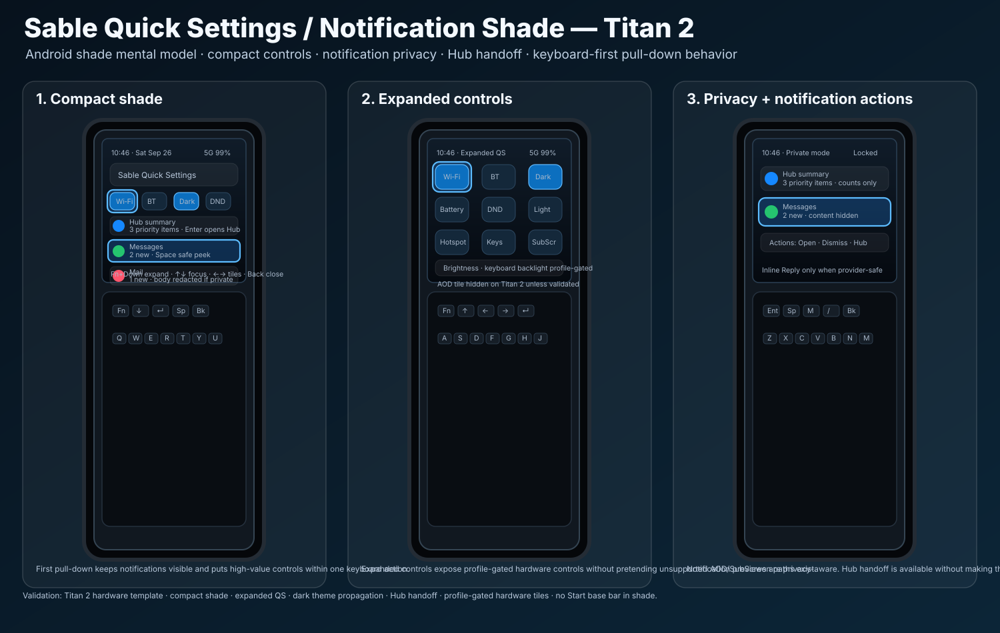

# Quick Settings / Notification Shade visual confirmation

Status: **source-controlled visual target — keyboard-first shade**

This document binds the Quick Settings / Notification Shade UX contract to a
Titan 2 visual artifact for future UI/build validation.



## Scope

The artifact covers the Titan 2 square profile and the common keyboard-first
shade model that should also inform Titan 2 Elite and Q27 after independent
profile validation.

```text
QUICK_SETTINGS_VISUAL_ARTIFACT_SOURCE_CONTROLLED=YES
CHAT_ONLY_IMAGE=NO
TITAN2_QS_VISUAL_TARGET=YES
ANDROID_NOTIFICATION_SHADE_MENTAL_MODEL=KEEP
TITAN2_HARDWARE_TEMPLATE=YES
BUILD_CODE_CHANGED=NO
DEVICE_CODE_CHANGED=NO
FLASH_ENABLEMENT=NO
```

## Required visual elements

Implementation should preserve the following structure unless a later reviewed
visual replaces it:

```text
Compact shade
  time/date/status row
  compact Quick Settings tiles
  visible keyboard focus
  privacy-aware notification rows
  Hub summary / handoff
  shortcut hint row

Expanded Quick Settings
  larger tile grid
  brightness / keyboard-backlight control where supported
  profile-gated SubScreen / attention controls
  notifications below controls

Notification actions
  Open
  Dismiss
  Snooze
  Reply, provider-safe only
  Open in Hub, when safe
```

## Base-bar decision

Sable Start has a configurable base quick bar. Quick Settings / Notification
Shade does **not** inherit that bar.

```text
START_BASE_QUICK_BAR_IN_SHADE=NO
SHADE_IS_SYSTEM_CONTROL_SURFACE=YES
SHADE_IS_NOT_LAUNCHER=YES
SHADE_IS_NOT_HUB=YES
```

## Theme propagation target

Dark theme is a required QS control and must propagate to Sable apps.

```text
DARK_THEME_QS_TILE=REQUIRED
SABLE_APPS_FOLLOW_SYSTEM_THEME=REQUIRED
THEME_CHOICE_PROPAGATES_TO_SABLE_APPS=REQUIRED
```

## Keyboard target

```text
Fn + Down
  open compact shade

Fn + Down again
  expand Quick Settings

Fn + Up
  collapse one level

Enter
  activate focused item

Space
  toggle tile or safe-peek notification

Back
  close shade or return one level
```

## Build/UI validation checklist

Future implementation or visual review should produce evidence for:

```text
QUICK_SETTINGS_VISUAL_ARTIFACT_PRESENT=PASS
SOURCE_CONTROLLED_VISUAL_TARGET=PASS
TITAN2_HARDWARE_TEMPLATE=PASS
SQUARE_DISPLAY_PLUS_PHYSICAL_KEYBOARD=PASS
NO_SLAB_PHONE_VISUAL_TARGET=PASS
NO_STRETCHED_SCREEN_TARGET=PASS
ANDROID_NOTIFICATION_SHADE_MENTAL_MODEL=PASS
COMPACT_SHADE=PASS
EXPANDED_QS=PASS
DARK_THEME_PROPAGATION=PASS
KEYBOARD_BACKLIGHT_TILE_PROFILE_GATED=PASS
SUBSCREEN_TILE_PROFILE_GATED=PASS
AOD_TILE_PROFILE_GATED=PASS
HUB_HANDOFF_FROM_SHADE=PASS
NOTIFICATION_PRIVACY_REDACTION=PASS
INLINE_REPLY_PROVIDER_SAFE=PASS
NO_FOCUS_TRAPS=PASS
START_BASE_QUICK_BAR_IN_SHADE=NO
```

## Non-goals

```text
NO_MAC_DESIGN_BUILD_REQUIRED
NO_DEVICE_BUILD_REQUIRED_FOR_THIS_ARTIFACT
NO_FLASH_ENABLEMENT
NO_START_BASE_BAR_IN_SHADE
NO_UNSUPPORTED_AOD_TILE_ON_TITAN2
NO_UNSUPPORTED_PROVIDER_ACTIONS
```
