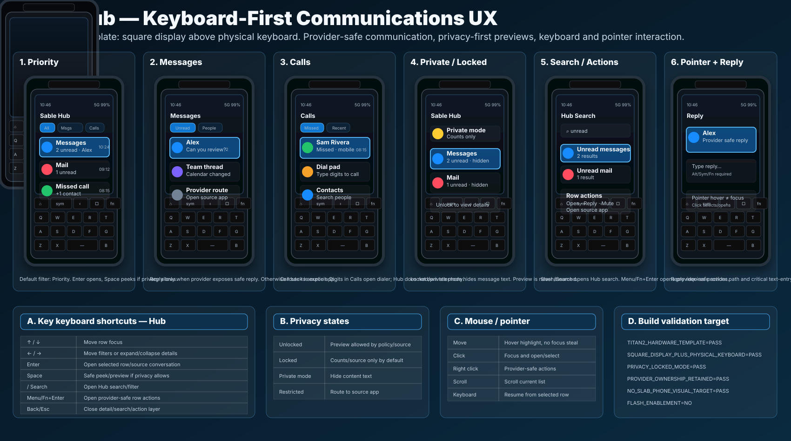

# Sable Hub visual confirmation

Status: **source-controlled visual target — keyboard-first Hub**

This document binds the Sable Hub keyboard-first UX contract to a durable visual
artifact for Titan 2 square profile validation.



## Scope

The artifact covers the Titan 2 square Sable Hub target and the common
keyboard-first Hub model that should also inform Titan 2 Elite and Q27.

```text
SABLE_HUB_VISUAL_ARTIFACT_SOURCE_CONTROLLED=YES
CHAT_ONLY_IMAGE=NO
TITAN2_HUB_VISUAL_TARGET=YES
TITAN2_HARDWARE_TEMPLATE=YES
SQUARE_DISPLAY_PLUS_PHYSICAL_KEYBOARD=YES
NO_SLAB_PHONE_VISUAL_TARGET=YES
NO_STRETCHED_SCREEN_TARGET=YES
BUILD_CODE_CHANGED=NO
DEVICE_CODE_CHANGED=NO
FLASH_ENABLEMENT=NO
```

## Required visual elements

Implementation should preserve the following user-visible structure unless a
later reviewed visual replaces it:

```text
Hub top level
  title: Sable Hub
  visible filter chips
  Priority default filter
  compact communication rows
  strong focus ring on selected row
  source/provider ownership visible or inferable from row source

Messages state
  unread rows
  provider-safe reply/open behavior

Calls state
  missed calls
  dial/contact actions routed to Phone/provider

Private/locked state
  counts and categories only by default
  no message text preview unless policy allows

Search/actions state
  Hub-local search
  provider-safe row actions

Pointer/reply state
  pointer hover does not steal keyboard focus
  reply requires provider-supported safe reply
```

## Keyboard target

```text
Up / Down
  move row focus

Left / Right
  move filter focus or collapse/expand supported row details

Enter
  open selected row/source detail

Space
  safe peek/preview if privacy policy allows

/ or Search key
  open Hub search/filter

Menu / Fn+Enter
  open row actions

Back / Esc
  close detail/search/action layer

Home
  return to Sable Start / Home
```

## Privacy target

```text
UNLOCKED_ALLOWED
  preview content only when user/source policy allows

LOCKED_OR_PRIVATE
  counts/source category only by default

SOURCE_RESTRICTED
  route to source app for details
```

## Provider-safety target

```text
PROVIDER_OWNERSHIP_RETAINED=YES
SOURCE_APP_ROUTE_VISIBLE=YES
INLINE_REPLY_PROVIDER_SAFE=YES
INVENT_UNSUPPORTED_ACTIONS=NO
```

## Build/UI validation checklist

Future implementation or visual review should produce evidence for:

```text
SABLE_HUB_VISUAL_ARTIFACT_PRESENT=PASS
TITAN2_HARDWARE_TEMPLATE=PASS
SQUARE_DISPLAY_PLUS_PHYSICAL_KEYBOARD=PASS
NO_SLAB_PHONE_VISUAL_TARGET=PASS
NO_STRETCHED_SCREEN_TARGET=PASS
HUB_PRIORITY_FILTER_DEFAULT=PASS
FILTER_BAR_VISIBLE=PASS
VISIBLE_FOCUS=PASS
KEYBOARD_NAVIGATION=PASS
HUB_SEARCH=PASS
PROVIDER_OWNERSHIP_RETAINED=PASS
PROVIDER_SAFE_ROW_ACTIONS=PASS
INLINE_REPLY_PROVIDER_SAFE=PASS
PRIVACY_LOCKED_MODE=PASS
PRIVATE_MODE_COUNTS_ONLY=PASS
MOUSE_POINTER_INTERACTION=PASS
NO_FOCUS_TRAPS=PASS
```

## Non-goals

```text
NO_MAC_DESIGN_BUILD_REQUIRED
NO_DEVICE_BUILD_REQUIRED_FOR_THIS_ARTIFACT
NO_FLASH_ENABLEMENT
NO_PROVIDER_DATABASE_OWNERSHIP_IN_HUB
NO_UNSUPPORTED_ACTION_SYNTHESIS
NO_LAUNCHER_BASE_BAR_IN_HUB_CONTENT
```
