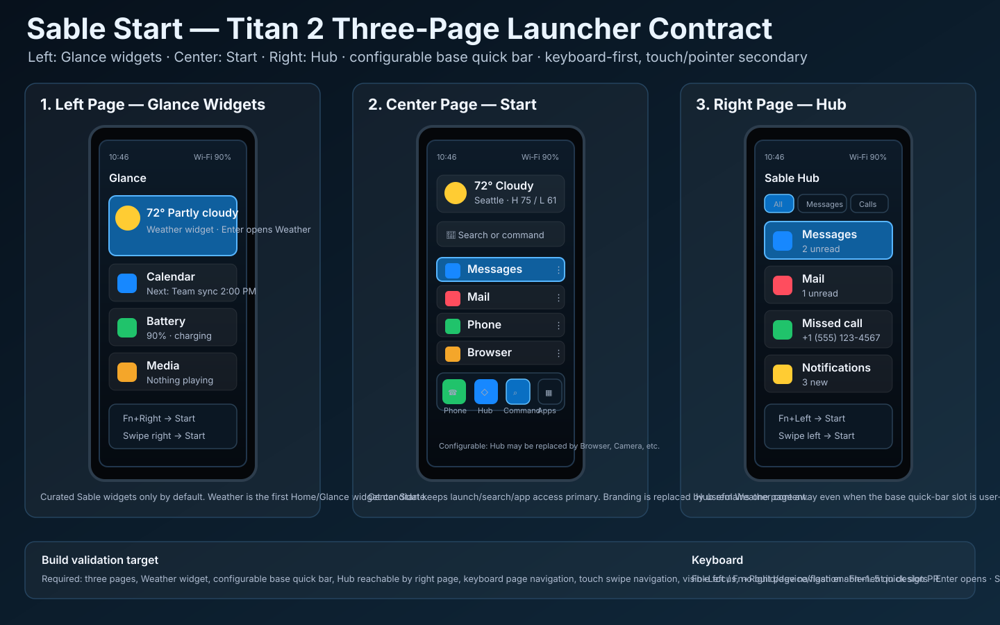

# Sable Start visual confirmation

Status: **source-controlled visual target — PR #14 follow-up alignment**

This document binds the Sable Start keyboard-first UX contract to a visual
artifact that can be reviewed before implementation and used as a target for
future UI/build validation.



## Scope

The artifact covers the Titan 2 square profile and the common keyboard-first
launcher model that also informs Titan 2 Elite and Q27 compact profiles.

```text
VISUAL_ARTIFACT_SOURCE_CONTROLLED=YES
CHAT_ONLY_IMAGE=NO
TITAN2_SQUARE_VISUAL_TARGET=YES
TITAN2_HARDWARE_TEMPLATE=REQUIRED
SQUARE_DISPLAY_PLUS_PHYSICAL_KEYBOARD=REQUIRED
THREE_PAGE_START_MODEL=YES
BASE_QUICK_BAR_CONFIGURABLE=YES
BUILD_CODE_CHANGED=NO
DEVICE_CODE_CHANGED=NO
FLASH_ENABLEMENT=NO
```

## Titan 2 visual-template requirement

Sable Start visual validation must use Titan 2 hardware proportions unless the
artifact is explicitly for another device profile.

```text
TITAN2_TEMPLATE_FOR_VISUAL_VALIDATION=YES
NO_SLAB_PHONE_VISUAL_TARGET=YES
NO_STRETCHED_SCREEN_TARGET=YES
SCREEN_ABOVE_PHYSICAL_KEYBOARD=YES
```

Reason:

```text
Titan 2 has a square display and physical keyboard.
Launcher density, base-bar placement and page navigation must be validated against that geometry.
Slab-phone mockups hide layout failures that will appear on actual Titan 2 hardware.
```

## Required visual elements

Implementation should preserve the following user-visible structure unless a
later reviewed visual replaces it:

```text
Left page
  Glance widgets
  Weather expanded
  Calendar / battery / media examples

Center page
  Weather widget instead of SableOS logo/text
  Search or command field
  user-selected Home apps
  configurable base quick bar

Right page
  Sable Hub
  compact Hub tabs/filters
  messages, mail, missed calls and notifications
```

## Base quick bar contract

The base quick bar must be persistent on Center Start and user-configurable.

Recommended default:

```text
Phone | Hub | Command | All Apps
```

Allowed user examples:

```text
Phone | Browser | Command | All Apps
Phone | Camera  | Command | All Apps
Browser | Mail  | Command | All Apps
```

Rules:

```text
BASE_BAR_REORDER=REQUIRED
BASE_BAR_REPLACE_SLOTS=REQUIRED
HUB_BASE_SLOT_REPLACEABLE=YES
HUB_ACCESS_STILL_AVAILABLE=RIGHT_PAGE
COMMAND_ACCESS_REQUIRED=YES
ALL_APPS_ACCESS_REQUIRED=YES
BASE_BAR_RESET_TO_DEFAULT=REQUIRED
```

## Widget contract

The Weather area on Center Start is a curated Sable widget/home module, not
branding filler.

```text
WEATHER_WIDGET_ON_HOME=REQUIRED_DEFAULT
CURATED_SABLE_WIDGETS=YES
GENERIC_FREEFORM_WIDGETS=NO_BY_DEFAULT
LEFT_PAGE_GLANCE_WIDGETS=YES
```

Future curated widgets may include:

```text
Weather
Calendar / next event
Hub summary
Mail summary
Media / now playing
Battery / charging
Tasks / reminders
Device status
```

## Navigation target

```text
Center Start -> swipe left / Fn+Left  -> Glance widgets
Center Start -> swipe right / Fn+Right -> Hub
Home from any Start page              -> Center Start
Fn+1..5                               -> base quick bar slots
Enter                                 -> open focused item
Space                                 -> safe preview / peek
Back                                  -> close overlay or return one layer
```

## Build/UI validation checklist

Future implementation or visual review should produce evidence for:

```text
SABLE_START_VISUAL_ARTIFACT_PRESENT=PASS
SOURCE_CONTROLLED_VISUAL_TARGET=PASS
TITAN2_HARDWARE_TEMPLATE=PASS
NO_SLAB_PHONE_VISUAL_TARGET=PASS
NO_STRETCHED_SCREEN_TARGET=PASS
CENTER_WEATHER_WIDGET=PASS
SABLEOS_BRANDING_NOT_CENTER_CONTENT=PASS
THREE_PAGE_START_MODEL=PASS
LEFT_PAGE_GLANCE_WIDGETS=PASS
RIGHT_PAGE_HUB=PASS
BASE_QUICK_BAR_VISIBLE=PASS
BASE_QUICK_BAR_CONFIGURABLE=PASS
BASE_QUICK_BAR_REORDER=PASS
HUB_SLOT_REPLACEABLE=PASS
HUB_RIGHT_PAGE_REACHABLE=PASS
KEYBOARD_PAGE_NAVIGATION=PASS
TOUCH_SWIPE_PAGE_NAVIGATION=PASS
VISIBLE_FOCUS=PASS
NO_FOCUS_TRAPS=PASS
```

## Non-goals

```text
NO_MAC_DESIGN_BUILD_REQUIRED
NO_DEVICE_BUILD_REQUIRED_FOR_THIS_ARTIFACT
NO_FLASH_ENABLEMENT
NO_GENERIC_FREEFORM_WIDGET_CANVAS_BY_DEFAULT
NO_CODE_IMPORT_FROM_REFERENCED_LAUNCHERS
```
