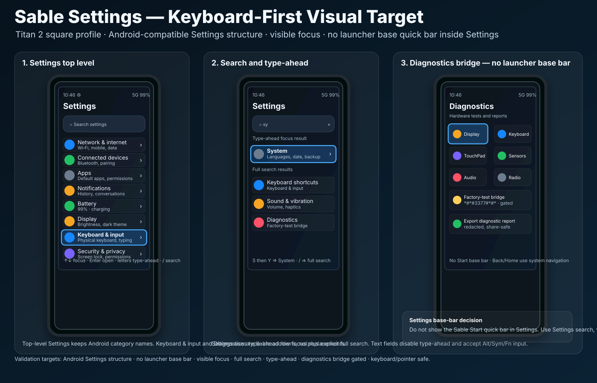

# Settings visual confirmation

Status: **source-controlled visual target — keyboard-first Settings**

This document binds the keyboard-first Settings UX contract to a durable visual
artifact for Titan 2 square profile validation.



## Scope

The artifact covers the Titan 2 square Settings target and the common
keyboard-first Settings model that should also inform Titan 2 Elite and Q27.

```text
SETTINGS_VISUAL_ARTIFACT_SOURCE_CONTROLLED=YES
CHAT_ONLY_IMAGE=NO
TITAN2_SETTINGS_VISUAL_TARGET=YES
ANDROID_SETTINGS_STRUCTURE=PRIMARY
START_BASE_QUICK_BAR_IN_SETTINGS=NO
BUILD_CODE_CHANGED=NO
DEVICE_CODE_CHANGED=NO
FLASH_ENABLEMENT=NO
```

## Base-bar decision

Sable Start has a configurable base quick bar. Settings does **not** inherit that
bar.

Reason:

```text
Settings is a system configuration surface, not a launcher surface.
Android Settings familiarity is a primary requirement.
Titan 2 screen space is limited.
Settings already needs persistent search and visible focus.
Launcher app shortcuts would compete with Settings navigation and content.
```

Required posture:

```text
START_BASE_QUICK_BAR_IN_SETTINGS=NO
SETTINGS_SEARCH_VISIBLE=YES
VISIBLE_FOCUS=YES
SYSTEM_BACK_HOME_NAVIGATION=YES
OPTIONAL_SHORTCUT_HINT_FOOTER=YES
```

A small shortcut hint footer is allowed, for example:

```text
↑↓ Focus · Enter Open · / Search · Back Return
```

That footer is not a launcher dock and must not contain app-launch shortcuts.

## Required visual elements

Implementation should preserve the following user-visible structure unless a
later reviewed visual replaces it:

```text
Top level
  title: Settings
  visible search field near top
  Android-compatible categories
  Sable additions: Keyboard & input, Attention & SubScreen, Diagnostics
  strong focus ring on selected row

Search state
  full Settings search field
  type-ahead row navigation support
  Settings search result rows with parent categories

Diagnostics state
  Display, Keyboard, TouchPad, Sensors, Audio, Radio
  Factory-test bridge visible but gated
  Export diagnostic report
```

## Type-ahead and search target

```text
S on top-level Settings
  focus first visible S row, such as Sound & vibration

S then Y within timeout
  focus System

/ or Search key
  open full Settings search

Typing while search field focused
  edit search text, not row navigation

Alt / Sym / Fn in search fields
  required to enter alternate characters and symbols
```

## Diagnostics target

Titan 2 factory-test evidence, including `*#*#3377#*#*`, is represented as a
safe diagnostics bridge.

```text
DIALER_CODE_FACTORY_TEST_BRIDGE=YES
RAW_FACTORY_TEST_DIRECT_LAUNCH=NO_BY_DEFAULT
MUTATING_CALIBRATION_ONE_TAP=NO
EXPERT_WARNING_FOR_FACTORY_BRIDGE=YES
EXPORT_LOGS_REDACTED=YES
```

## Build/UI validation checklist

Future implementation or visual review should produce evidence for:

```text
SETTINGS_VISUAL_ARTIFACT_PRESENT=PASS
SETTINGS_TOP_LEVEL_ANDROID_STRUCTURE=PASS
SETTINGS_SEARCH_VISIBLE=PASS
START_BASE_QUICK_BAR_IN_SETTINGS=NO
VISIBLE_FOCUS=PASS
KEYBOARD_INPUT_ROW_VISIBLE=PASS
DIAGNOSTICS_ROW_VISIBLE=PASS
TYPE_AHEAD_FOCUS_NAVIGATION=PASS
TYPE_AHEAD_MULTI_LETTER_PREFIX=PASS
FULL_SETTINGS_SEARCH=PASS
ALT_SYM_FN_TEXT_ENTRY=PASS
DIAGNOSTICS_BRIDGE_GATED=PASS
RAW_FACTORY_TEST_DIRECT_LAUNCH=NO
NO_FOCUS_TRAPS=PASS
```

## Non-goals

```text
NO_MAC_DESIGN_BUILD_REQUIRED
NO_DEVICE_BUILD_REQUIRED_FOR_THIS_ARTIFACT
NO_FLASH_ENABLEMENT
NO_LAUNCHER_BASE_BAR_IN_SETTINGS
NO_GENERIC_FACTORY_TEST_MENU_AS_NORMAL_SETTINGS
```
