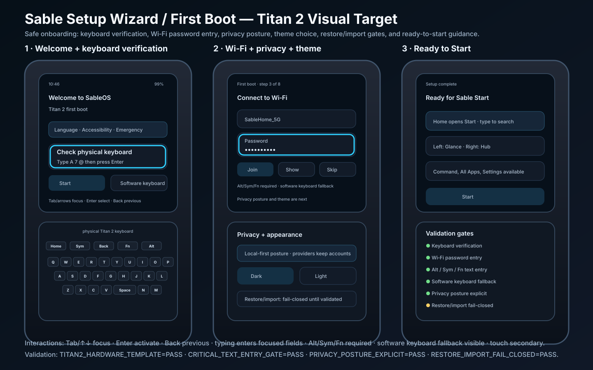

# Setup Wizard / First Boot visual confirmation

Status: **source-controlled Titan 2 visual target — 2026-09-26**

This document confirms the visual target for Setup Wizard / First Boot on Titan 2.



## Scope

```text
SETUP_WIZARD_VISUAL_ARTIFACT_SOURCE_CONTROLLED=YES
CHAT_ONLY_IMAGE=NO
TITAN2_SETUP_VISUAL_TARGET=YES
ANDROID_SETUP_MENTAL_MODEL=PRIMARY
TITAN2_HARDWARE_TEMPLATE=YES
SQUARE_DISPLAY_PLUS_PHYSICAL_KEYBOARD=YES
NO_SLAB_PHONE_VISUAL_TARGET=YES
NO_STRETCHED_SCREEN_TARGET=YES
BUILD_CODE_CHANGED=NO
DEVICE_CODE_CHANGED=NO
FLASH_ENABLEMENT=NO
```

## Required visual states

The Setup Wizard artifact must show the Titan 2 square display plus physical keyboard and must include these states:

```text
WELCOME_STATE=YES
KEYBOARD_VERIFICATION_STATE=YES
WIFI_PASSWORD_STATE=YES
PRIVACY_AND_THEME_STATE=YES
READY_TO_START_STATE=YES
INTERACTION_TABLE_VISIBLE=YES
```

## Layout requirements

```text
TITLE_VISIBLE=YES
PROGRESS_VISIBLE=YES
PRIMARY_ACTION_VISIBLE=YES
SECONDARY_SKIP_OR_BACK_VISIBLE=YES
VISIBLE_FOCUS=YES
NO_FOCUS_TRAPS=YES
SOFTWARE_KEYBOARD_FALLBACK_VISIBLE=YES
```

Setup must fit the square Titan 2 display. The design must not rely on a tall slab-phone viewport.

## Interaction requirements

```text
Tab / arrows        move focus
Enter               activate focused action
Back / Esc          previous step where allowed
Typing              enters text when field focused
Alt / Sym / Fn      enter alternate characters where required
Long press / menu   show field or provider actions where available
Touch               secondary path only
```

## Critical text-entry validation

```text
PHYSICAL_KEYBOARD_PIN_PASSWORD_ENTRY=PASS_REQUIRED
WIFI_PASSWORD_ENTRY=PASS_REQUIRED
ACCOUNT_SIGN_IN_ENTRY=PASS_REQUIRED_IF_PROVIDER_ENABLED
LOCK_METHOD_ENTRY=PASS_REQUIRED
ALT_SYM_FN_TEXT_ENTRY=PASS_REQUIRED
SOFTWARE_KEYBOARD_FALLBACK=PASS_REQUIRED
```

## Privacy and restore validation

```text
PRIVACY_POSTURE_EXPLICIT=PASS
TELEMETRY_DEFAULT_OFF_OR_EXPLICIT=PASS
PROVIDER_OWNERSHIP_EXPLAINED=PASS
RESTORE_IMPORT_FAIL_CLOSED=PASS
NO_PROVIDER_CREDENTIAL_OWNERSHIP_BY_SABLE=PASS
```

## Theme validation

```text
THEME_CHOICE_VISIBLE=PASS
DARK_THEME_SELECTION=PASS
SYSTEM_THEME_SOURCE_OF_TRUTH=PASS
SABLE_APPS_FOLLOW_SYSTEM_THEME=PASS
```

## Acceptance checklist

```text
SETUP_WIZARD_VISUAL_ARTIFACT_PRESENT=PASS
SOURCE_CONTROLLED_VISUAL_TARGET=PASS
TITAN2_HARDWARE_TEMPLATE=PASS
SQUARE_DISPLAY_PLUS_PHYSICAL_KEYBOARD=PASS
NO_SLAB_PHONE_VISUAL_TARGET=PASS
NO_STRETCHED_SCREEN_TARGET=PASS
WELCOME_STATE=PASS
KEYBOARD_VERIFICATION_STATE=PASS
WIFI_PASSWORD_STATE=PASS
PRIVACY_AND_THEME_STATE=PASS
READY_TO_START_STATE=PASS
VISIBLE_FOCUS=PASS
NO_FOCUS_TRAPS=PASS
SOFTWARE_KEYBOARD_FALLBACK=PASS
ALT_SYM_FN_TEXT_ENTRY=PASS
PRIVACY_POSTURE_EXPLICIT=PASS
RESTORE_IMPORT_FAIL_CLOSED=PASS
THEME_CHOICE_VISIBLE=PASS
BUILD_CODE_CHANGED=NO
DEVICE_CODE_CHANGED=NO
FLASH_ENABLEMENT=NO
```
